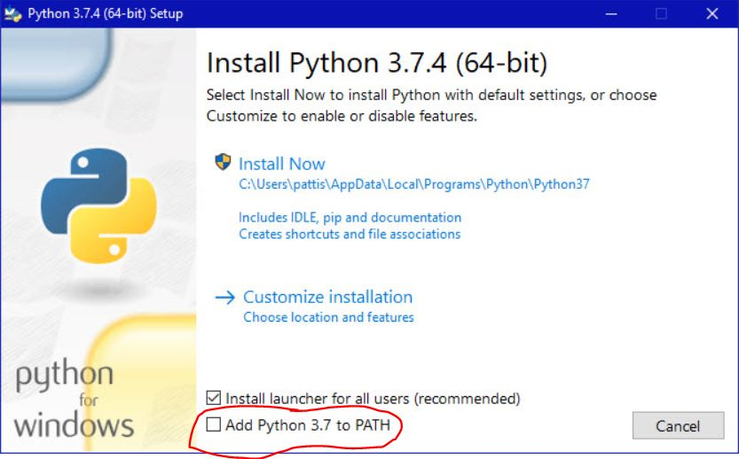

# Welcome to AI Club!

**Contents**
- [Welcome to AI Club!](#welcome-to-ai-club)
- [What is Artificial Intelligence?](#what-is-artificial-intelligence)
- [Python Environment Setup](#python-environment-setup)
  - [Python](#python)
  - [Git](#git)
  - [VS Code](#vs-code)
  - [Why Python?](#why-python)
- [Plans for this year](#plans-for-this-year)
- [References](#references)

# What is Artificial Intelligence?

Like it or not, artificial intelligence surrounds our everyday lives. If you have ever used any of the following technologies, you have interacted with an AI to some extent.
- Apple's Face ID or Windows Hello
- Siri, Alexa, or Google assistant
- Searched for anything on Google
- Used Google Maps
- Watched a video on Youtube
- **Browsed any form of social media**
- etc.

The list goes on and on, the uses of artificial intelligence in out modern day and age are endless. Seeing such technologies associated with big name companies like Google, Apple, or Amazon may signficantly complicate our perception AI.

However, we are here to tell you that behind all the math involved, AI is solely the formatting and storage of data. It is not some celestial consciousness that knows all. When one thinks of AI, they should really be thinking of a list of numbers whose parameters get altered to fit incoming data.

Now, how do we get something this simple to recognize faces, predict the outcomes of actions, and even talk to us humans like they are one of us?

Well, we give it huge lists of numbers ordered in specific ways to fit the task at hand, and change the numbers based on how well it predicts certain outputs. 

Throughout this year, we will try to accommodate you with a programming language and teach you the basic math and code behind multiple different AI models. Our overall goal is to help you understand what artificial intelligence really means by the end of the school year.

# Python Environment Setup

Python will be our programming language of choice for this club ([why?](#why-python)). We will need to download a few things to get started with coding in python.
- [Python](#python)
- [Git](#git)
- [VS Code](#vs-code)

## Python

This is what will actually allow our programs to run.

Download the latest version of Python from [its website](https://www.python.org/downloads/).

Simply follow the setup instructions, and **DON'T FORGET TO CHECK "ADD TO PATH"**. This will allow you to access Python from anywhere.

## Git

Git is a tool that allows us to work with code more efficiently.

Download Git from [its website](https://git-scm.com/downloads).

**If you are on Windows** you will also need to download [Git Bash](https://git-scm.com/downloads).

## VS Code

*If you already have an IDE you can skip this step!*

VS Code (Visual Studio Code) is an Integrated Development Environment (IDE) brought to us by our friends over at Microsoft. (It's much better for editing code than Google Docs.)

Download VS Code from [its website](https://code.visualstudio.com/download).

Create a new folder on your desktop (or anywhere else) to store all of the code we will be writing in AI Club.

## Why Python?

Most importantly, because it is considered the best language for machine learning thanks to a wide arsenal of available tools and libraries.

Also, its fast(er than javascript) and rather intuitive. (also because we're too lazy to code in c++)

# Plans for this year

Throughout the course of this school year, we will teach you the fundementals of simple AI models such as regression, perceptrons, and genetic algorithm neural networks by teaching you all of the math behind them, making them from scratch using NumPy, and then using an external library such as TensorFlow or PyTorch to optimize the models.

We believe that making something from scratch is the best way to grasp a concept.

Once you learn these simple machine learning models, we will move on to create more advanced models such as convolutional and LSTM neural networks.

We hope that all of you will enjoy learning about machine learning as much as we enjoy teaching it! We look forward to an excitement-filled school year with STR AI Club!

# References

https://www.ics.uci.edu/~pattis/common/handouts/pythoneclipsejava/python.html
